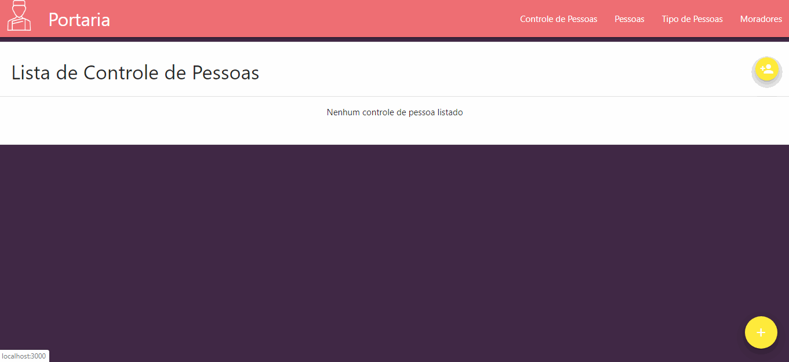

# Controle de Portaria
Simples aplicação que registra entrada e saída de pessoas em condomínios.




## Funcionalidades
- Adiciona, lista, altera e exclui Moradores.
- Adiciona, lista e exclui Tipo de Pessoas.
- Adiciona, lista, altera e exclui Pessoas.
- Adiciona, lista, altera e exclui Controle de Pessoas.
- Seleciona Tipo de Pessoa para o cadastro de Pessoas.
- Seleciona Pessoa e Morador para o cadastro de Controle de Pessoas.


## Tecnologias
-  [ReactJS](https://reactjs.org/)
-  [Redux](https://redux.js.org/)
-  [Redux-Saga](https://redux-saga.js.org/)
-  [React Router v4](https://github.com/ReactTraining/react-router)
-  [Materialize](https://materializecss.com)
-  [JSON Server](https://github.com/typicode/json-server)

## Executando a aplicação
```bash
# Clone o repositório
$ git clone https://github.com/gentini/portaria_web_master.git (ou use ssh)


# Entre na pasta criada
$ cd portaria_web_master

# Instale as dependências
$ yarn install (ou npm)

# Execute a aplicação
$ yarn dev
```

## Próximos passos
Aplicação simples, mas na medida que as necessidades vão surgindo, novas implementações serão desenvolvidas.

### Algumas possibilidades:

- Desenvolver a parte de backend com Node.js
- Adicionar controle de usuários com autenticação e autorização

---


Agradecimentos: Márcio França Lima.
